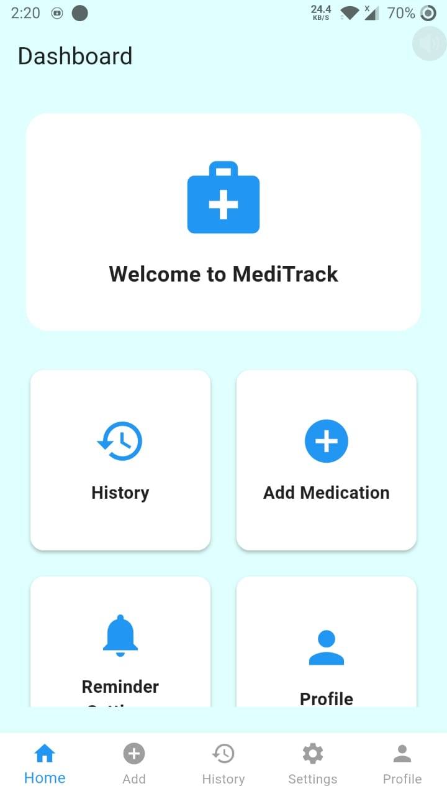
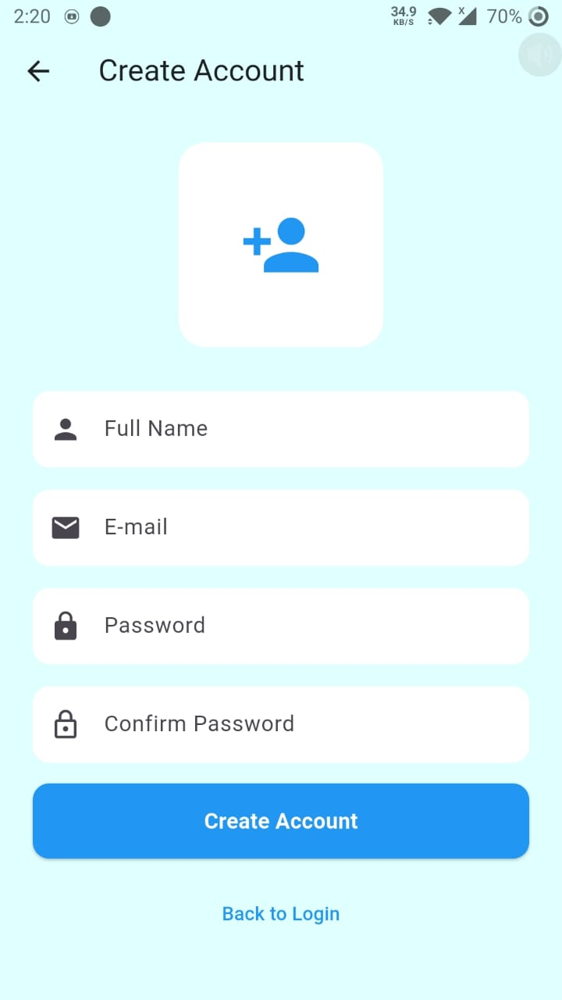
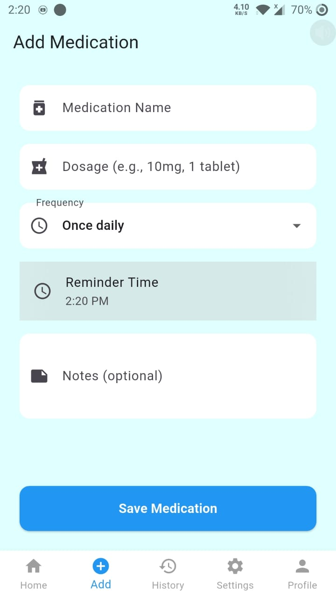
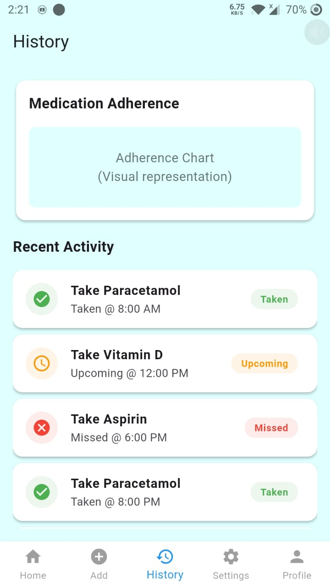
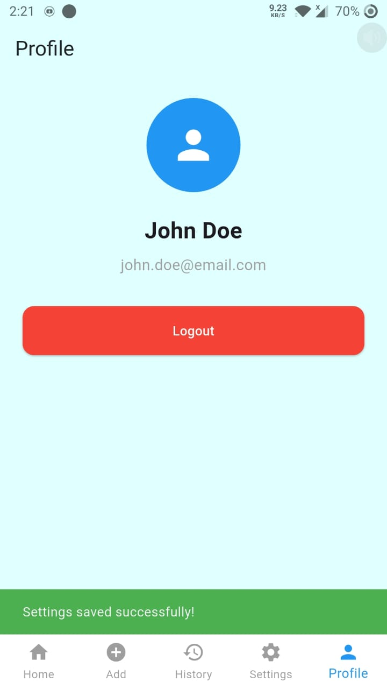
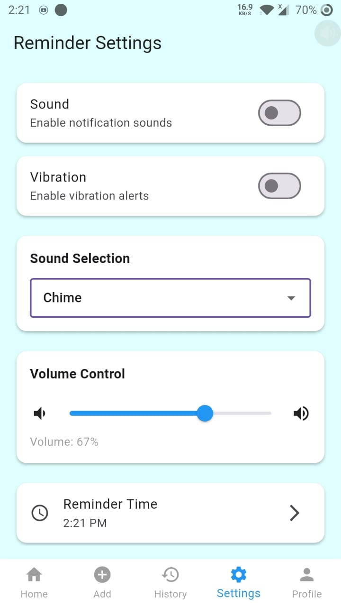
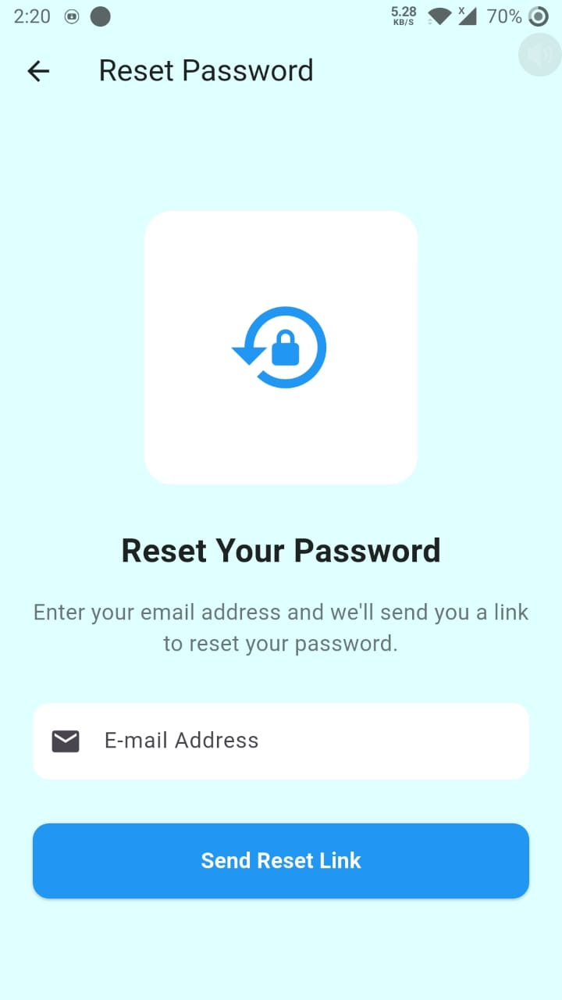
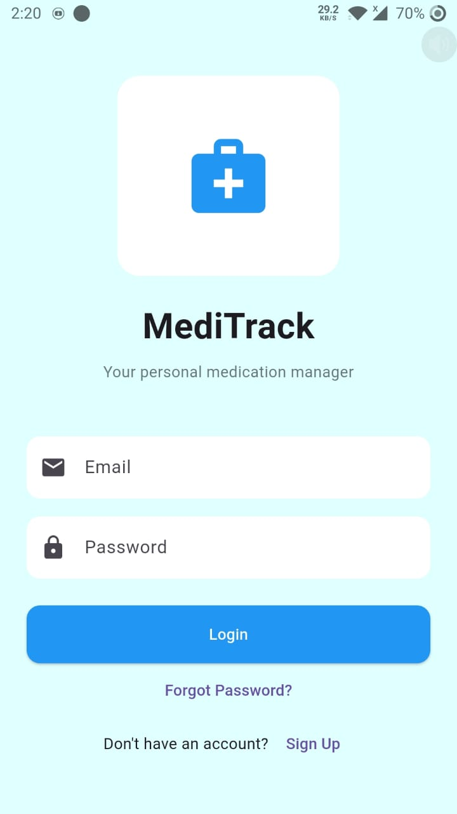

# MediTrack 💊

MediTrack is a Flutter-based medical application developed to help users track, manage, and order medicines in a simple and efficient way. It helps users manage their medications, set reminders, maintain history, and even place orders from their mobile devices.

## Overview
The application focuses on providing an easy-to-use interface for users who want to search medicines, upload prescriptions, and place orders from their mobile devices.

## Features
- User Authentication: Secure login and account creation
- Medication Management: Add, edit, and delete medications
- Smart Reminders: Set custom reminder times and frequencies
- Medication History: Track your medication intake over time
- Online medicine ordering
- Medicine and health product search
- Prescription upload support
- Clean and user-friendly interface
- Fully responsive Flutter application

## Screenshots 📱










## Getting Started 🚀

### Prerequisites
- Flutter SDK (>=3.0.0)
- Dart SDK (>=3.0.0)
- Android Studio / VS Code
- Chrome (for web development)

### Installation
1. Clone the repository
```bash
git clone https://github.com/yourusername/medi_track_app.git
cd medi_track_app
